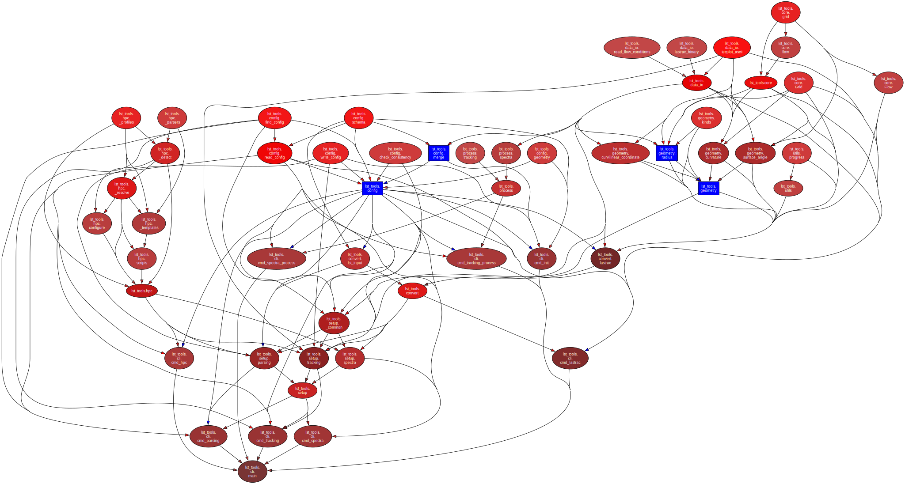

# Package Architecture

Visual overview of the `lst_tools` module structure and data flow.

## Module Dependency Graph



[Download architecture (SVG)](../assets/architecture.svg){ .md-button download="lst_tools_architecture.svg" }
[View in browser](../assets/architecture.svg){ .md-button target="_blank" }

??? info "Regenerate"

    ```bash
    pydeps src/lst_tools --noshow --max-bacon=4 --cluster -o docs/assets/architecture.svg
    ```

## Module Overview

| Subpackage | Responsibility |
|------------|----------------|
| `cli` | Typer CLI — thin wrappers that dispatch to library functions |
| `config` | Read, write, validate TOML config; consistency checks |
| `core` | `Grid` and `Flow` dataclasses — central data containers |
| `convert` | HDF5 mean-flow → LASTRAC binary; input-deck generation |
| `data_io` | File I/O: Fortran binary, LASTRAC binary, Tecplot ASCII, flow conditions |
| `geometry` | Surface geometry: curvature, curvilinear coordinate, surface angle, radius |
| `setup` | Case setup: parsing, tracking, and spectra configuration |
| `process` | Post-processing: tracking and spectra results |
| `hpc` | HPC environment detection, job script generation |
| `utils` | Shared helpers (progress bars) |

## Data Flow

```
                        ┌──────────┐
                        │  config  │  TOML read / write / validate
                        └────┬─────┘
                             │
                             ▼
┌─────────┐  read    ┌─────────────┐  convert_meanflow   ┌───────────┐
│ data_io │ ───────▶ │  Grid, Flow │ ──────────────────▶  │  convert  │
└─────────┘          │   (core)    │                      └─────┬─────┘
                     └─────────────┘                            │
                             │                                  │
                             │ geometry                         │ LASTRAC binary +
                             ▼                                  │ input deck
                     ┌─────────────┐                            │
                     │  geometry   │                            │
                     └─────────────┘                            ▼
                                                        ┌─────────────┐
                                                        │    setup    │
                                                        │  parsing /  │
                                                        │  tracking / │
                                                        │  spectra    │
                                                        └──────┬──────┘
                                                               │
                                                               │ run LASTRAC
                                                               ▼
                                                        ┌─────────────┐
                                                        │   process   │
                                                        │  tracking / │
                                                        │  spectra    │
                                                        └──────┬──────┘
                                                               │
                                                               ▼
                                                        ┌─────────────┐
                                                        │     hpc     │
                                                        │ job scripts │
                                                        └─────────────┘
```

## CLI Command Hierarchy

The CLI uses Typer with two sub-groups (`setup`, `process`) to mirror
the LST workflow:

```
lst-tools
├── init              initialise a working directory with template config
├── lastrac           run the LASTRAC solver
├── setup
│   ├── parsing       set up LST parsing calculations
│   ├── tracking      set up LST tracking calculations
│   └── spectra       set up LST frequency-spectra calculations
├── process
│   ├── tracking      post-process tracking results
│   └── spectra       post-process spectra results
└── hpc               generate HPC job scripts
```

## External Dependencies

| Dependency | Usage |
|------------|-------|
| `cfd-io` | `FortranBinaryReader` / `FortranBinaryWriter` (re-exported via `data_io`) |
| `numpy` | Array computation throughout |
| `scipy` | Interpolation in geometry and setup modules |
| `typer` | CLI framework |
| `tomli` / `tomli-w` | TOML config read / write |
