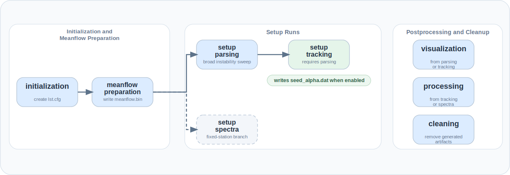

# Workflow

`lst-tools` supports a full workflow from case initialization to cleanup and
figure generation.

This section explains the phase structure, dependencies, and main outputs.
For runnable command-line or Python sequences, use
[CLI Usage](../user-guide/cli-usage.md) or
[API Usage](../user-guide/api-usage.md).

## Schematic

[Download workflow (SVG)](../assets/workflow.svg){ .md-button download="lst_tools_workflow.svg" }
[View in browser](../assets/workflow.svg){ .md-button target="_blank" }

## Workflow Phases

- [Initialization and Meanflow Preparation](initialization-meanflow-preparation.md)
- [Setup Runs](setup-runs.md)
- [Postprocessing and Cleanup](postprocessing-cleanup.md)